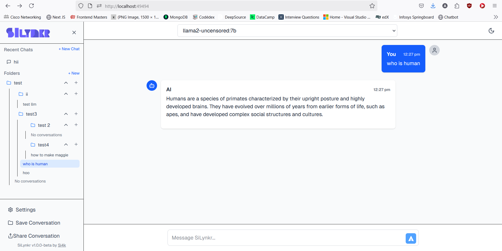

# SiLynkr - Modern AI Chat Interface


A modern, feature-rich chat interface for Ollama AI models. SiLynkr provides a professional-grade interface for interacting with locally running AI models, ensuring privacy, customization, and control over your AI interactions.

## 🌟 Why Choose SiLynkr?

- **Polished UI/UX**: Modern, clean interface with dark/light mode and multiple theme options
- **Full-featured**: Conversation history, hierarchical folder organization, PDF export
- **Advanced Options**: Complete access to all Ollama parameters
- **Storage Options**: MongoDB or local storage
- **Sharing Capabilities**: Share conversations via links, PDF, or text exports
- **Well-structured Code**: Maintainable, modular Next.js codebase

## 📸 Screenshots



## 🚀 Key Features

- **Ollama Model Selection**: Use any model available in your Ollama instance
- **Advanced Folder Organization**: 
  - Infinite folder nesting capability
  - Create subfolders directly from folder context menu
  - Start new chats directly within specific folders
- **Visual Status Indicators**:
  - Port status indicator showing connection health
  - Save status indicator showing whether changes are saved
- **Advanced Ollama Parameters**: Access all Ollama API parameters:
  - Temperature, Top-P, Top-K controls
  - Format options (JSON output)
  - Custom templates
  - Thinking mode, raw mode
  - Custom system prompts
  - Keep-alive duration control
- **PDF & Text Export**: Export your conversations in multiple formats
- **Share via Link**: Generate shareable conversation links
- **MongoDB Integration**: Store conversations in MongoDB or use localStorage
- **Modern UI**: Responsive design with multiple theme options (Light, Dark, Obsidian, Nature, Sunset)
- **Conversation History**: Configurable context window for AI interactions
- **Smart Port Management**: Automatic port selection with fallbacks

## 🏁 Getting Started

### Prerequisites

- [Node.js](https://nodejs.org/) (v18 or newer)
- [Ollama](https://ollama.ai/) installed and running on your machine
- [MongoDB](https://www.mongodb.com/) (optional, for conversation storage)

### Quick Installation

1. Clone the repository:
```bash
git clone https://github.com/si4k/silynkr.git
cd silynkr
```

2. Install dependencies:
```bash
npm install
```

3. Start the development server:
```bash
npm run dev
```

4. SiLynkr will automatically select port 49494 (or a fallback if unavailable)
   - A colorful message will indicate the running port in the terminal
   - The UI will display the current port status indicator in the input area

## 🔌 Port Configuration

SiLynkr uses a smart port selection system with automatic fallbacks. By default, it tries to use port 49494, but will try other ports if that one is unavailable.

### Default Port Sequence

| Port  | Description                               |
|-------|-------------------------------------------|
| 49494 | Primary port (Default)                    |
| 49049 | Fallback #1 (Mirror-style symmetry)       |
| 49994 | Fallback #2 (Maxed out pattern)           |
| 51951 | Fallback #3 (Si4k-inspired)               |
| 54321 | Fallback #4 (Debug/Test)                  |
| 3006  | Dev environment                           |
| 6969  | UI Testing                                |

### Customizing Ports

You can customize the port settings in two ways:

1. **Environment variable**: Set `PORT=your_port` in your environment or .env file
2. **Settings file**: Edit `settings.json` to change the primary and fallback ports

```json
{
  "serverSettings": {
    "primaryPort": 49494,
    "fallbackPorts": [49049, 49994, 51951, 54321, 3006, 6969]
  }
}
```

## 💬 Usage

### Basic Chat

1. Select an Ollama model from the dropdown menu
2. Type your message and press Enter
3. View the AI's response with full markdown and code highlighting

### Advanced Features

#### Folder and Conversation Management

- **Hierarchical Folders**: Create unlimited nested folders for perfect organization
- **Quick Actions**: Use the "+" button on any folder to:
  - Create subfolders directly within that folder
  - Start new chats that are automatically assigned to that folder
- **Add Tags**: Apply tags to conversations for easier filtering
- **Save Conversations**: Manually save or enable auto-save after responses
- **Share Conversations**: Generate shareable links with privacy settings

#### Ollama Parameters

Access all Ollama parameters through the settings dialog:

- Temperature, Top-P, Top-K
- Response format (default or JSON)
- Custom suffix text
- Custom prompt templates
- Keep-alive duration
- Thinking mode for compatible models
- Raw mode for unformatted prompts

#### Multiple Themes

Choose from several built-in themes:
- Light
- Dark
- Obsidian
- Nature
- Sunset
- Custom (customizable)

#### Storage Options

You can configure MongoDB in two ways:

1. **Environment Variable**: Set `MONGODB_URI` in `.env`
2. **UI Settings**: Add MongoDB URI in the settings panel

If no MongoDB connection is available, the app will use localStorage.

## 🏗️ Architecture

- **Frontend**: Next.js 15+ with React and Tailwind CSS
- **Backend**: Next.js API routes
- **Database**: MongoDB with localStorage fallback
- **AI Integration**: Connects to local Ollama instance

## 👩‍💻 Development

### Available Scripts

- `npm run dev` - Start the Next.js development server
- `npm run build` - Build the application for production
- `npm run start` - Start the production server
- `npm run api` - Start only the API server

## 📄 License

This project is licensed under the MIT License - see the LICENSE file for details.

## 🙏 Acknowledgements

- [Ollama](https://ollama.ai/) for providing the local AI model runtime
- [Next.js](https://nextjs.org/) for the React framework
- [Tailwind CSS](https://tailwindcss.com/) for styling
- [KaTeX](https://katex.org/) for mathematical expression rendering

## About Si4k

SiLynkr is developed and maintained by [Si4k](https://si4k.me), a company focused on creating intuitive AI interfaces and tools. Visit our [website](https://si4k.me) for more information and other products.
        